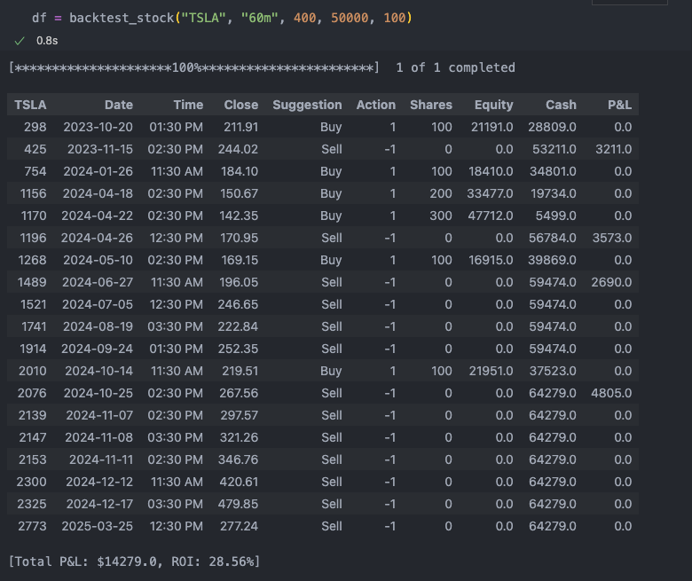
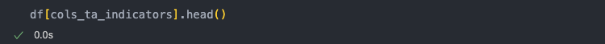
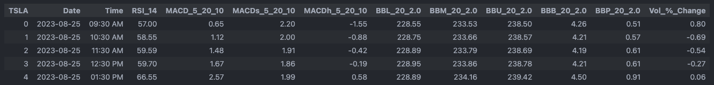
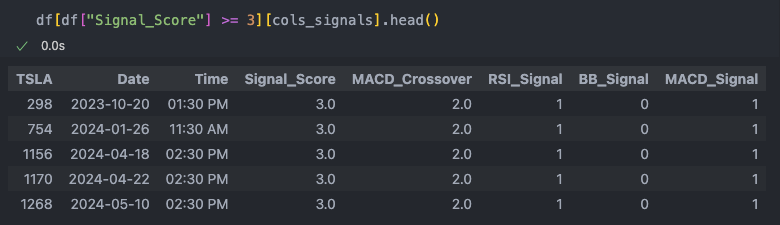
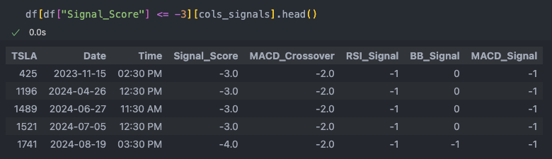
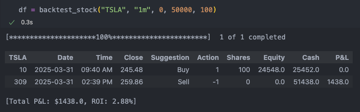
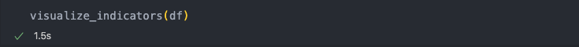
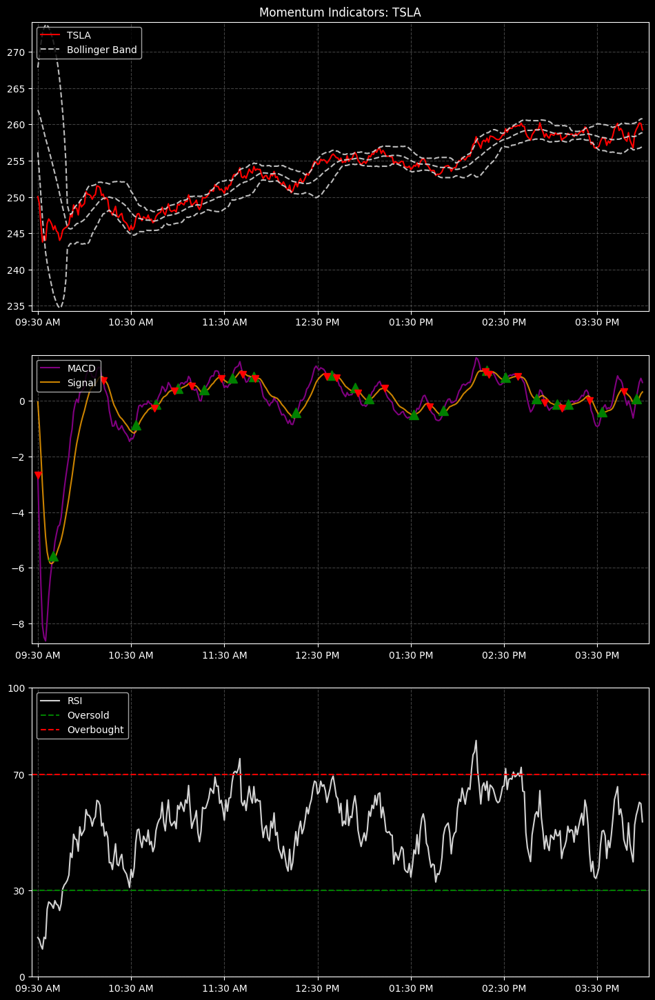
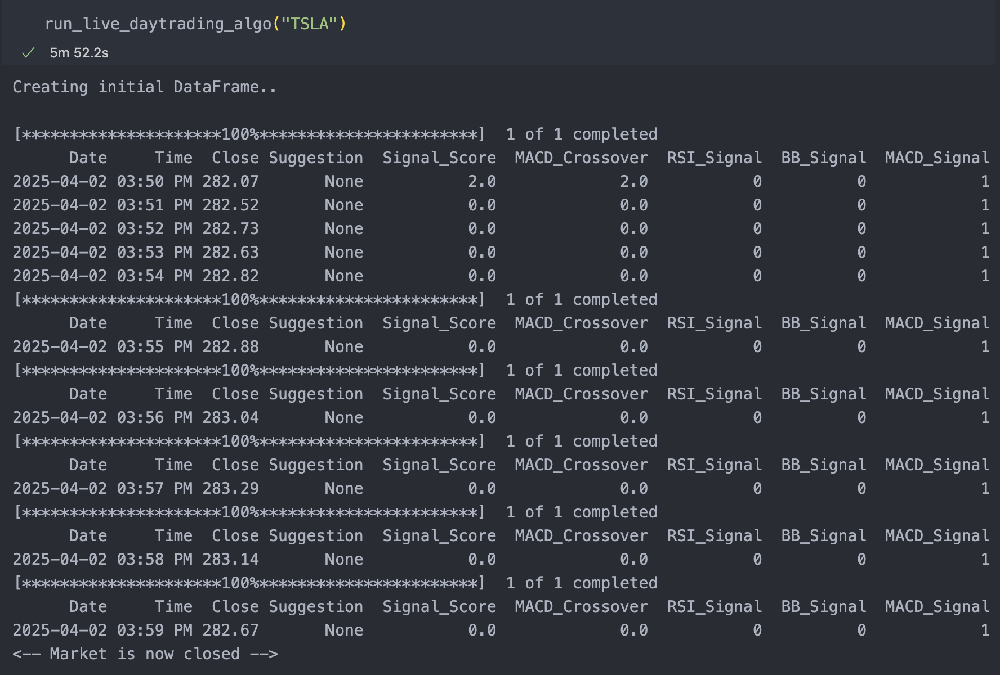

# Algorithmic Trading Using Technical Analysis Indicators (RSI, Bollinger Bands, MACD)

##  Overview

For this project, I created a trading algorithm that pulls stock data from Yahoo Finance and then suggests either a buy or sell signal based on three technical analysis indicators: RSI, Bollinger Bands, and MACD. When both a MACD crossover is present AND either RSI is oversold or share price is within 10% of the lower bollinger band, the algorithm triggers a buy signal (and a sell in the opposite case). 

Core libraries: pandas, pandas_ta, yfinance, matplotlib  

View [code (Python)](https://github.com/aanshkapadia/algorithmic-trading-ta-indicators/blob/main/main.py)
</br>
  
## Modules
````python
1. backtest_stock(ticker, interval, backtest_days, cash, shares_increment):
  
Retrieves price history, calculates TA indicators, and then displays any suggested trade as well as total P&L if said trades were executed during given timeframe.

#  [Inputs]
#  ticker: stock symbol
#  interval: interval for calculating technical analysis indicators 
#           (accepted values: "1m", "2m", "5m", "15m", "30m", "60m")
#  backtest_days: num business days to backtest
#  cash: starting cash
#  shares: num shares to purchase (every buy signal)
````    
#### Calculate P&L backtesting TSLA:

<br/><br/>


#### View TA indicators calculated for first 5 rows of data:

<br/>
<br/><br/>

#### View rows where a BUY signal was triggered (signal_score == 3 or 4):

<br/><br/>

#### View rows where a SELL signal was triggered (signal_score == -3 or -4):
<br/><br/>


````python
2. visualize_indicators(df): 

Visualizes technical analysis indicators using matplotlib.

#  [Inputs]
#  df: dataframe returned by backtest_stock() function
```` 

<br/>

<br/>
<br/><br/>
 
 

 
````python
3. run_live_daytrading_algo(ticker): 

Fetches price history up to current minute, then calculates technical indicators and suggests a trade based on signal_score ('Buy' if >= 3, 'Sell' if <= -3). Repeats every '1m' until market close. 

#  [Inputs]
#  ticker: stock symbol
````  

<br/><br/>